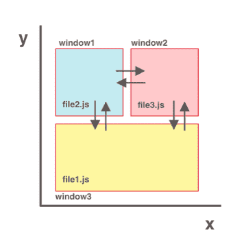
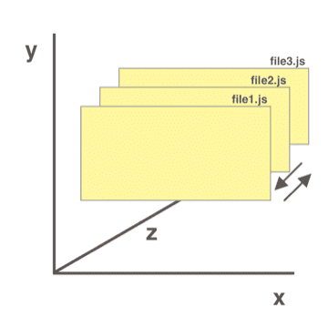

### tips: 

###### 如果没有在命令上加上 `# xxxxx`表示例外，则该命令默认是`command mode`命令

## 缓冲区

```bash
# 打开缓冲区
:b filename    :buffer filename		#打开并切换为目标缓冲区(不支持TAB补全文件名)(无法新建)
# 查看缓冲区
:buffers    :ls    :files
# 遍历缓冲区
:bn    :bnex    :bnext				# 下一个缓冲区
:bp    :bpre    :bprevious			# 上一个缓冲区
:b filename    :buffer fiilename	# 切换缓冲区到目标文件(支持TAB补全文件名)
:b1    :b 1    :b2    :b 2			# 切换到指定缓冲区
# shortcut
ctrl-^								# 切换到上一个编辑的缓冲区(^指小键盘的6)
# 关闭缓冲区
:bd filename    :bdelete fiilename	# 关闭指定的缓冲区(支持TAB补全文件名)
:bd1    :bd 1    :bdelete 1			# 关闭指定的缓冲区(bd关闭自己)
:q    :quit    :qall    :quitall	# 关闭所有缓冲区


# 新建缓冲区窗口
:new filename						# 创建目标文件的缓冲区以及窗口(支持TAB补全文件名)(不支持缩写)
# 分割缓冲区窗口
:sp filename    :split filename		# 分割出指定文件的缓冲区的窗口(分割的目标窗口出现在顶部，当前窗口出现在底部)(不存在则创建)(sp分割自己)
:vsp filename    :vsplit filename	# 分割出指定文件的缓冲区的窗口(分割的目标窗口出现在左边，当前窗口出现在右边)
# 切换缓冲区窗口
# shortcut
ctrl-w move-command					# 移动`光标`到`move-command`指定方向的的窗口(hjkl->左下上右)(ctrl-w-w双击w进行顺序切换)
# 缓冲区窗口快捷键
# shortcut
ctrl-w v/s/[c/q]/o					# 效果分别为:vsp/:sp/关闭一个窗口[vim/neovim]/关闭其他窗口，`only`留下当前窗口


# 标签(选项卡)
# 标签(选项卡)并不会直接打开一个文件(除非你刷新缓冲区并将其保存到文件)，它会停留在内存中的缓冲区中(多个标签存在于一个窗口中)
:tabnew filename					# 新建一个标签(支持TAB补全文件名，如果你想打开一个已经存在的文件作为标签的话)
:tabc    :tabclose					# 关闭当前标签
:tabn    :tabnex    :tabnext		# 切换至下一个标签
:tabp    :tabpre    :tabprevious	# 切换至上一个标签
:tabf    :tabfirst					# 切换至第一个标签
:tabl    :tablast					# 切换至最后一个标签
# shortcut
[n]g(T/t)							# 转到前/后(对应T/t)(g必须小写)n个标签，不指定n默认为1
```

## 补充(图片来自[这里](https://github.com/iggredible/Learn-Vim/blob/master/ch02_buffers_windows_tabs.md))

在窗口之间移动就像在笛卡尔坐标中沿 X-Y 轴二维移动一样，可以使用`ctrl-w move-command`移至 `上/下/左/右` 窗口.



在缓冲区之间移动就像在笛卡尔坐标中在Z轴上移动一样，缓冲区文件在Z轴上对齐，可以使用`:bnext`和`:bpre`一次在Z轴上移动一个缓冲区，或者`:b1 :b2`和`:b filename`在多个缓冲区之间跳转.

